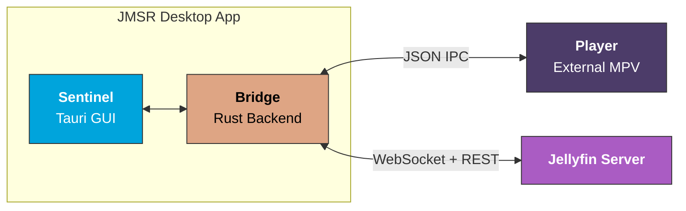

# JMSR - Jellyfin MPV Shim Rust

<div align="center">

[](https://github.com/hewel/jmsr/actions/workflows/ci.yml)
[](https://www.rust-lang.org/)
[](https://v2.tauri.app/)
[](https://www.solidjs.com/)
[](LICENSE)

**A high-performance Jellyfin cast receiver that controls an external MPV player.**  
Built with Tauri v2, Solid.js, and Rust.

[Features](#-features) • [Quick Start](#-quick-start) • [Architecture](#-architecture) • [Troubleshooting](#-troubleshooting)

</div>

---

## 📖 Overview

JMSR allows you to cast media from any Jellyfin client (web, mobile, TV) to your desktop, where it plays in MPV with full support for your custom configurations, shaders, and scripts.

> **💡 Key Philosophy**
>
> JMSR does **NOT** embed `libmpv`. Instead, it spawns and controls a standalone MPV process via JSON IPC. This preserves your existing `mpv.conf`, shader packs (Anime4K, FSR, etc.), and all local customizations without compromise.

## ✨ Features

| Feature | Description |
| :--- | :--- |
| 📺 **Cast Target** | Appears as a controllable device in Jellyfin's cast menu |
| 🚀 **External MPV** | Full compatibility with your system MPV configuration and shaders |
| 🔒 **Persistent Auth** | Login once, stay connected with secure token storage |
| 🔄 **Auto-Reconnect** | Resilient WebSocket connection with exponential backoff strategy |
| ⏭️ **Smart Playback** | Automatically plays the next episode when the current one finishes |
| 🧠 **Series Memory** | Remembers audio/subtitle language preferences per TV series |
| ⌨️ **Shortcuts** | Use `Shift+N` / `Shift+P` directly in MPV to skip episodes |
| 🖥️ **System Tray** | Runs quietly in the background with quick access controls |
| 🛡️ **Type-Safe** | 100% type-safe Rust-to-TypeScript communication via `tauri-specta` |
| 🍏 **Cross-Platform** | Native support for Windows, macOS, and Linux |

## 🏗️ Architecture

JMSR utilizes a robust three-actor architecture to ensure stability and separation of concerns.



1.  **Sentinel (Tauri GUI)**: Handles UI, WebSocket connection to Jellyfin, and state management.
2.  **Bridge (Rust IPC)**: Translates commands and manages the external process.
3.  **Player (MPV)**: The standalone media player instance running your config.

## 🚀 Quick Start

### Prerequisites

*   [MPV](https://mpv.io/) installed and in PATH

### Installation

#### Download Pre-built Binaries (Recommended)

Download the latest release for your platform from the [Releases page](https://github.com/hewel/jmsr/releases):

| Platform | Download |
| :--- | :--- |
| **Windows** | `.msi` (installer) or `.exe` (NSIS) |
| **macOS** | `.dmg` |
| **Linux** | `.deb` or `.AppImage` |

#### Build from Source

<details>
<summary>Development prerequisites</summary>

*   [Bun](https://bun.sh/) (or npm/yarn)
*   [Rust](https://rustup.rs/) (latest stable)
*   Tauri CLI: `bun add -g @tauri-apps/cli`

</details>

```bash
# Clone the repository
git clone https://github.com/your-username/jmsr.git
cd jmsr

# Install dependencies
bun install

# Build production binaries
bunx tauri build
```

Binaries will be in `src-tauri/target/release/bundle/`.

### Usage Steps

1.  **Launch JMSR** from your application menu or terminal.
2.  **Authenticate** by entering your Jellyfin server URL and credentials.
3.  **Cast Media**: JMSR will appear as "JMSR" in your Jellyfin client's cast menu.
4.  **Enjoy**: Media plays in MPV on your desktop with full control syncing.

## 🛠️ How It Works

1.  **Authentication**: User logs into Jellyfin and receives an access token.
2.  **Registration**: JMSR posts capabilities to `/Sessions/Capabilities/Full`.
3.  **WebSocket**: Connects to Jellyfin for real-time play state control.
4.  **Cast Event**: When user casts, Jellyfin sends a `Play` command.
5.  **MPV Control**: JMSR spawns MPV (if needed) and sends JSON IPC commands.
6.  **Progress**: Event-driven progress reporting via MPV property observation.
7.  **Sync**: Pause/seek/volume commands flow bidirectionally (Jellyfin ↔ MPV).
8.  **Auto-Play**: Automatically fetches the next episode upon natural file end.

## 💻 Development

### Project Structure

```bash
jmsr/
├── src/                    # Solid.js frontend
│   ├── index.tsx          # Entry point
│   ├── bindings.ts        # Auto-generated IPC bindings
│   └── components/        # UI components
├── src-tauri/             # Rust backend
│   ├── src/
│   │   ├── jellyfin/      # Jellyfin client implementation
│   │   └── mpv/           # MPV IPC driver logic
│   └── tauri.conf.json    # Tauri configuration
└── doc/PRD.md            # Product requirements
```

### Commands

| Task | Command |
| :--- | :--- |
| **Frontend Dev** | `bun run dev` |
| **Tauri Dev** | `bunx tauri dev` |
| **Build Prod** | `bunx tauri build` |
| **Test** | `bun run test` |
| **Lint/Format** | `bun run check` |

### 📏 Code Conventions

*   **TypeScript**: Single quotes, Biome formatting.
*   **Rust**: 2-space indent (standard `rustfmt.toml`).
*   **IPC**: Always use typed `commands.*` from bindings, never raw `invoke()`.
*   **Solid.js**: Use `createSignal`, `createResource` — **NOT** React hooks.

### ➕ Adding a Tauri Command

1.  **Add function** in `src-tauri/src/command.rs` with `#[tauri::command]` and `#[specta]`.
2.  **Register** in `src-tauri/src/lib.rs` inside `collect_commands![]`.
3.  **Regenerate** bindings by running `bunx tauri dev`.
4.  **Import** from `commands` in your TypeScript file.

### Technology Stack

| Component | Technology |
| :--- | :--- |
| **Framework** | [Tauri v2](https://v2.tauri.app) |
| **Frontend** | [Solid.js](https://www.solidjs.com) + TypeScript |
| **Backend** | Rust |
| **Bundler** | Rsbuild |
| **Styling** | TailwindCSS |
| **IPC** | tauri-specta |
| **Linting** | Biome |
| **Testing** | Rstest |

## ❓ Troubleshooting

<details>
<summary><strong>JMSR doesn't appear as cast target</strong></summary>

*   Ensure you're logged in (check Settings page shows "Connected").
*   Refresh the Jellyfin web page after JMSR connects.
*   Check Jellyfin Dashboard > Activity for the JMSR session.
</details>

<details>
<summary><strong>MPV doesn't start</strong></summary>

*   Verify MPV is installed: `mpv --version`.
*   Check MPV is in PATH (or set explicit path in Settings).
*   **Windows (Scoop)**: JMSR auto-resolves symlinks, but ensure the shim is valid.
*   Check Settings > MPV Player for detected path.
</details>

<details>
<summary><strong>Video doesn't play</strong></summary>

*   Check Jellyfin transcoding settings.
*   Verify network connectivity to Jellyfin server.
*   Check JMSR log panel (Settings page) for error messages.
</details>

<details>
<summary><strong>Connection lost</strong></summary>

*   JMSR auto-reconnects with exponential backoff (1s → 60s).
*   Check network connectivity.
*   Toast notifications will indicate connection status.
</details>

## 🤝 Contributing

Contributions are welcome! Please follow these steps:

1.  Fork the repository.
2.  Create a feature branch.
3.  Follow existing code conventions (Biome for TS, rustfmt for Rust).
4.  Run `bun run check` before committing.
5.  Submit a pull request.

## 📄 License

MIT License - see [LICENSE](LICENSE) for details.

## 🙏 Acknowledgments

*   [jellyfin-mpv-shim](https://github.com/jellyfin/jellyfin-mpv-shim) - The original Python inspiration.
*   [Tauri](https://tauri.app/) - For the amazing desktop framework.
*   [MPV](https://mpv.io/) - The best media player in existence.
